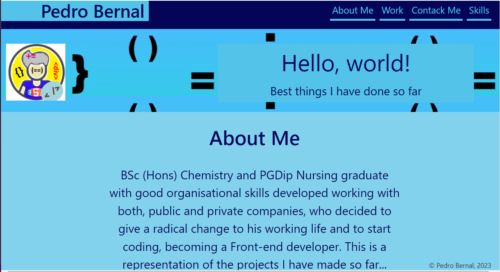
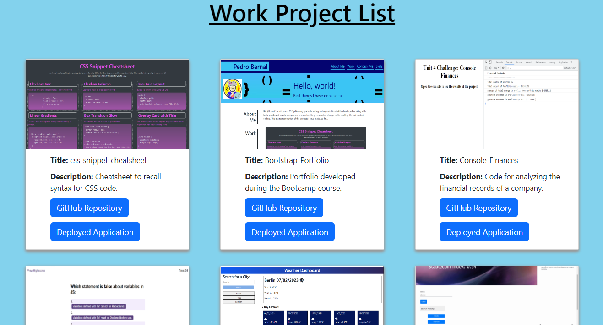
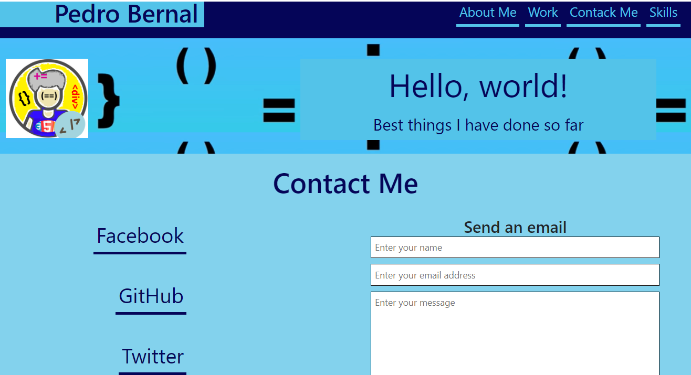
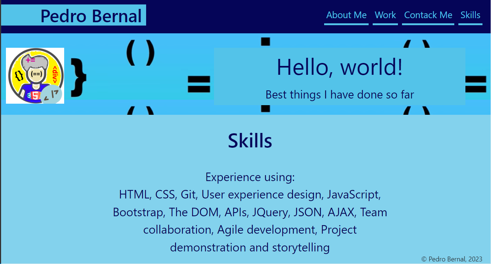

# React-Portfolio

## Description

This project is a portfolio made using the React technology. The internet is a great place to showcase your skilll. This portfolio aims to show some of the work I have completed so far and the skills developped in the pocess. The development of the applications was a great opportunity to consolidate the knowledge about the use of React.

- URL of the functional, deployed application: https://pedrobe9.github.io/react-portfolio/  
= URL of the GitHub repository: https://github.com/Pedrobe9/react-portfolio 

## Table of Contents (Optional)

If your README is long, add a table of contents to make it easy for users to find what they need.

- [Installation](#installation)
- [Usage](#usage)
- [Credits](#credits)
- [License](#license)
- [Features](#features)
- [Starting](#starting)

## Installation

Application ready to use.
Below you will find information on how to use the Create React App.

## Usage
Application is ready to use. Use the navigation bar to move between the different sections of the portfolio. The section 'About Me@ gives you a very brief introduction to who I am. You can see examples of my work in the section 'Work'. You can contact me using the section 'Contact Me', there you have links to my GitHub account, LinkedIn and you can get access to a CV in pdf format. The links for Facebook and Twitter are not active but have been included for future inclusion. You can also send me an email using your local email, just fill the form on the page and click submit and the process will be activated. The 'Skill sections enumerates the skills aquired during training (and also working in a different field).
Below you can see screenshots of the different pages of this project.

## Credits

Pedro Bernal

## License

MIT License.

## Features

The Application has the initial landing page or home page, marked as 'About Me' in the navigation bar. There is another page ('Work')displayng the projects I am showcasing, a page to 'Contact Me' and a final page showing the 'Skills' as a developper.
Ways to contact me include: links to GitHub, LinkedIn, CV and a form to send me an email which will open with the email utility used by the user. There are placeholder links to Facebook and Twitter but they are not active, although I have included for future inclusion.

## Starting
##  Getting-Started-with-Create-React-App

This project was bootstrapped with [Create React App](https://github.com/facebook/create-react-app).

## Available Scripts

In the project directory, you can run:

### `npm start`

Runs the app in the development mode.\
Open [http://localhost:3000](http://localhost:3000) to view it in your browser.

The page will reload when you make changes.\
You may also see any lint errors in the console.

### `npm test`

Launches the test runner in the interactive watch mode.\
See the section about [running tests](https://facebook.github.io/create-react-app/docs/running-tests) for more information.

### `npm run build`

Builds the app for production to the `build` folder.\
It correctly bundles React in production mode and optimizes the build for the best performance.

The build is minified and the filenames include the hashes.\
Your app is ready to be deployed!

See the section about [deployment](https://facebook.github.io/create-react-app/docs/deployment) for more information.

### `npm run eject`

**Note: this is a one-way operation. Once you `eject`, you can't go back!**

If you aren't satisfied with the build tool and configuration choices, you can `eject` at any time. This command will remove the single build dependency from your project.

Instead, it will copy all the configuration files and the transitive dependencies (webpack, Babel, ESLint, etc) right into your project so you have full control over them. All of the commands except `eject` will still work, but they will point to the copied scripts so you can tweak them. At this point you're on your own.

You don't have to ever use `eject`. The curated feature set is suitable for small and middle deployments, and you shouldn't feel obligated to use this feature. However we understand that this tool wouldn't be useful if you couldn't customize it when you are ready for it.

## Learn More

You can learn more in the [Create React App documentation](https://facebook.github.io/create-react-app/docs/getting-started).

To learn React, check out the [React documentation](https://reactjs.org/).

### Code Splitting

This section has moved here: [https://facebook.github.io/create-react-app/docs/code-splitting](https://facebook.github.io/create-react-app/docs/code-splitting)

### Analyzing the Bundle Size

This section has moved here: [https://facebook.github.io/create-react-app/docs/analyzing-the-bundle-size](https://facebook.github.io/create-react-app/docs/analyzing-the-bundle-size)

### Making a Progressive Web App

This section has moved here: [https://facebook.github.io/create-react-app/docs/making-a-progressive-web-app](https://facebook.github.io/create-react-app/docs/making-a-progressive-web-app)

### Advanced Configuration

This section has moved here: [https://facebook.github.io/create-react-app/docs/advanced-configuration](https://facebook.github.io/create-react-app/docs/advanced-configuration)

### Deployment

This section has moved here: [https://facebook.github.io/create-react-app/docs/deployment](https://facebook.github.io/create-react-app/docs/deployment)

### `npm run build` fails to minify

This section has moved here: [https://facebook.github.io/create-react-app/docs/troubleshooting#npm-run-build-fails-to-minify](https://facebook.github.io/create-react-app/docs/troubleshooting#npm-run-build-fails-to-minify)
